# Livrable — Conception d'un SI sur Odoo 17
## Timz & Co · Module `timz_web_project`

**Étudiant :** MAHAMAT AHMAT TIMAN  
**Module :** Gestion d'une entreprise de développement web  
**Plateforme :** Odoo 17 Community Edition (Docker)  

---

## Table des matières

1. [Introduction](#1-introduction)
2. [Modélisation Métier — BPMN](#2-modélisation-métier--bpmn)
3. [Conception du SI](#3-conception-du-si)
4. [Réalisation et Manuel Utilisateur](#4-réalisation-et-manuel-utilisateur)
5. [Conclusion](#5-conclusion)

---

## 1. Introduction

### 1.1 Présentation de Timz & Co

**Timz & Co** est une entreprise de développement web créée dans le cadre de ce projet académique. Elle propose à ses clients des prestations numériques couvrant cinq domaines :

| Type de projet | Description |
|---|---|
| **Site Vitrine** | Présence web institutionnelle |
| **E-Commerce** | Boutique en ligne avec gestion des ventes |
| **Application Web** | Logiciel métier accessible via navigateur |
| **Application Mobile** | App iOS/Android |
| **Intégration ERP/CRM** | Connexion à des systèmes d'information existants |

L'entreprise compte deux rôles internes : les **Commerciaux/Utilisateurs** (saisie des demandes, suivi) et les **Managers** (gestion complète, facturation, rapports).

### 1.2 Problématique

Avant la mise en place du SI, Timz & Co gérait ses activités via des fichiers Excel et des échanges email disparates. Cela engendrait :

- des pertes d'informations entre la réception d'une demande client et le démarrage du projet ;
- l'absence de traçabilité des états de validation (demande → qualification → proposition → projet) ;
- aucune liaison entre les projets et la facturation, générant des oublis de facturation ;
- une gestion des droits d'accès inexistante (tout le monde voyait tout).

### 1.3 Objectif du projet

Concevoir et implémenter sur **Odoo 17** un module custom (`timz_web_project`) qui :

1. Centralise les demandes clients avec un workflow de validation multi-états ;
2. Génère automatiquement les devis/commandes et les projets Odoo associés ;
3. Produit les factures directement depuis les projets livrés ;
4. Segmente les accès selon deux groupes de sécurité.

---

## 2. Modélisation Métier — BPMN

Les trois processus métier de Timz & Co ont été modélisés en **BPMN 2.0** avec l'outil [bpmn.io](https://bpmn.io). Les fichiers source `.bpmn` sont disponibles dans `docs/diagrammes/Bpmn/codes/`.

### 2.1 Processus 1 — Réception et qualification de la demande client

Ce processus couvre la vie d'une demande depuis son dépôt par le client jusqu'à la décision commerciale (acceptée ou refusée).

**Acteurs impliqués :**

| Couloir (pool) | Rôle |
|---|---|
| **Client** | Dépose la demande via formulaire ou email |
| **Commercial / Utilisateur** | Réceptionne, analyse et qualifie la demande dans Odoo |
| **Système Odoo** | Crée l'opportunité CRM, envoie les notifications automatiques |

**Flux principal :**

1. Le client soumet sa demande (nom, type de projet, budget, délai souhaité).
2. Le commercial **réceptionne** et saisit la demande dans le module (`state = nouveau`).
3. Il **analyse et qualifie** la demande — si refusée, un email de refus est envoyé au client.
4. Si qualifiée, une opportunité **CRM (`crm.lead`)** est créée automatiquement.
5. Le commercial **rédige la proposition** et génère un **devis (sale.order)** dans Odoo.
6. Le client reçoit le devis et peut **accepter ou négocier**.
7. En cas d'accord, la demande passe à l'état `won` et un projet web est créé.

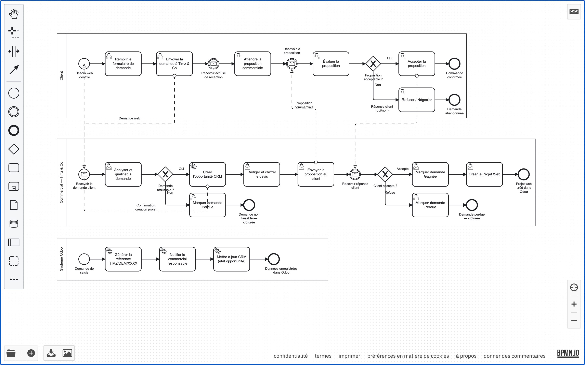

> Les fichiers BPMN source sont dans [docs/diagrammes/Bpmn/codes/processus_demande_client.bpmn](diagrammes/Bpmn/codes/processus_demande_client.bpmn)

---

### 2.2 Processus 2 — Suivi et réalisation du projet web

Ce processus décrit la gestion opérationnelle du projet depuis son démarrage jusqu'à sa livraison.

**Acteurs impliqués :**

| Couloir (pool) | Rôle |
|---|---|
| **Chef de Projet (Manager)** | Crée le projet, affecte l'équipe, valide la livraison |
| **Développeur (Utilisateur)** | Réalise les tâches techniques, signale les bugs |
| **Système Odoo** | Synchronise les tâches `project.project`, suit la progression |

**Flux principal :**

1. Le Manager **crée le Projet Web** dans le module et l'associe au projet Odoo natif.
2. Il **planifie les tâches** et les assigne aux développeurs.
3. Les développeurs **réalisent les tâches** et mettent à jour l'avancement (champ `progress`).
4. En cas de problème, une boucle de **correction des bugs** est initiée.
5. Le Manager **soumet le projet en revue** (`state = review`).
6. Après validation interne, le projet est **livré au client** (`state = delivered`).

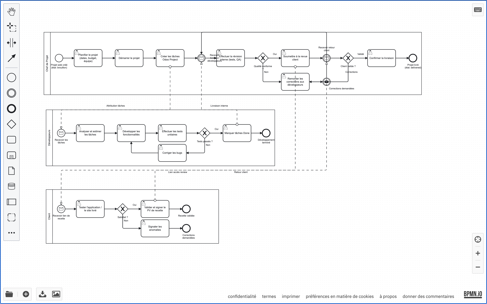

> Fichier source : [docs/diagrammes/Bpmn/codes/processus_suivi_projet_web.bpmn](diagrammes/Bpmn/codes/processus_suivi_projet_web.bpmn)

---

### 2.3 Processus 3 — Livraison et facturation

Ce processus couvre la phase finale : réception par le client, paiement et archivage.

**Acteurs impliqués :**

| Couloir (pool) | Rôle |
|---|---|
| **Chef de Projet (Manager)** | Rédige le PV de livraison, crée la facture dans Odoo |
| **Comptable / Facturation** | Valide et envoie la facture |
| **Client** | Réceptionne, vérifie et règle la facture |

**Flux principal :**

1. Le Manager **rédige le PV de livraison** et l'envoie au client pour signature.
2. Une **facture (`account.move`)** est créée depuis le projet web via le bouton dédié.
3. La facture est **validée** et envoyée au client.
4. Le client **effectue le paiement** (virement, chèque ou carte).
5. Le paiement est **enregistré** dans Odoo ; le projet passe à l'état `invoiced`.
6. Le projet est **archivé**.

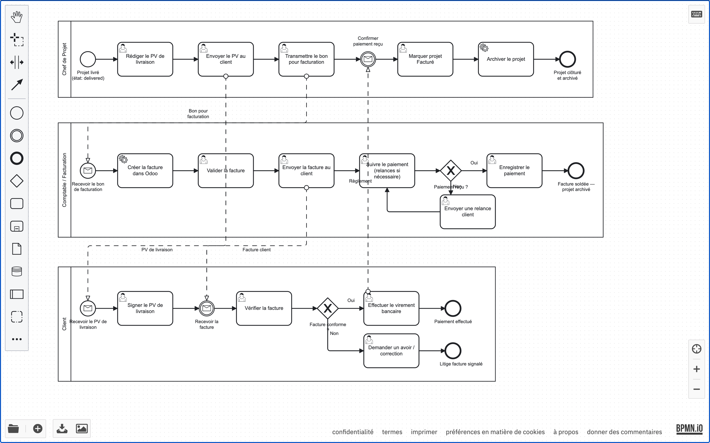

> Fichier source : [docs/diagrammes/Bpmn/codes/processus_livraison_facturation.bpmn](diagrammes/Bpmn/codes/processus_livraison_facturation.bpmn)

---

## 3. Conception du SI

### 3.1 Architecture technique

Le SI repose sur **Odoo 17 Community Edition** déployé via **Docker Compose** avec deux services :

- `odoo` — serveur applicatif (port 8069)
- `db` — base de données PostgreSQL (port 5432)

Une seule base de données `timz_db` contient toutes les tables. Chaque modèle Odoo correspond à une table PostgreSQL. Le module custom `timz_web_project` ajoute deux nouvelles tables.

### 3.2 Modules Odoo standards retenus

| Module Odoo | Objet technique | Justification |
|---|---|---|
| **CRM** (`crm`) | `crm.lead` | Gestion du pipeline commercial — qualification des demandes en opportunités |
| **Ventes** (`sale`) | `sale.order`, `sale.order.line` | Génération des devis et commandes de vente liés aux demandes |
| **Projet** (`project`) | `project.project`, `project.task` | Suivi opérationnel des tâches de développement |
| **Comptabilité** (`account`) | `account.move`, `account.journal` | Facturation des projets livrés |
| **Contacts** (`base`) | `res.partner`, `res.users` | Gestion des clients et des utilisateurs internes |
| **Chatter** (`mail`) | `mail.thread`, `mail.activity.mixin` | Historique de messagerie et activités sur chaque enregistrement |

> Ces modules ne sont pas recréés — ils sont **réutilisés et étendus** par le module custom via des champs Many2one (clés étrangères).

### 3.3 Diagramme de classes — Module custom `timz_web_project`

Le module custom introduit deux entités principales reliées entre elles :

- **`timz.client.request`** — Demande client (origine du flux)
- **`timz.web.project`** — Projet web (créé depuis la demande acceptée)

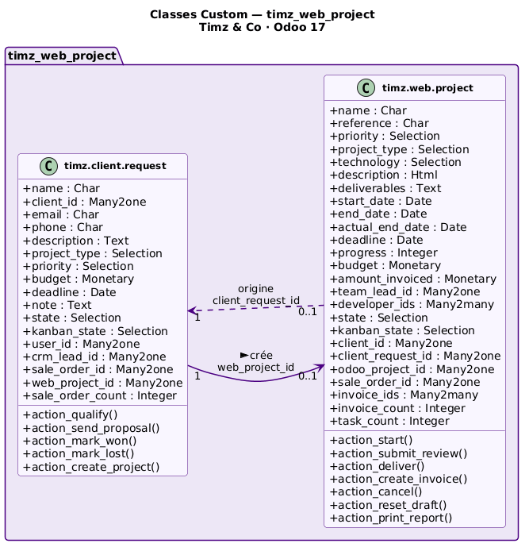

**Relation entre les deux entités :**

- Une demande (`timz.client.request`) peut créer **0 ou 1** projet web (`timz.web.project`) — relation `1 → 0..1` via le champ `web_project_id` / `client_request_id`.
- Chaque projet est donc toujours issu d'une demande qualifiée et acceptée.

### 3.4 Diagramme de classes — Modèles Odoo Standard utilisés

Ces six modèles Odoo sont référencés par les deux classes custom via des champs Many2one (clés étrangères en base).

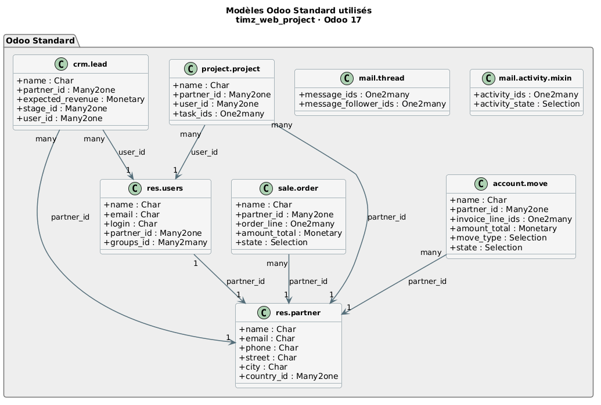

### 3.5 Diagramme de classes complet (vue d'ensemble)

Ce diagramme montre l'ensemble des relations entre les classes custom et les modèles Odoo standard, ainsi que l'héritage des mixins (`mail.thread`, `mail.activity.mixin`).

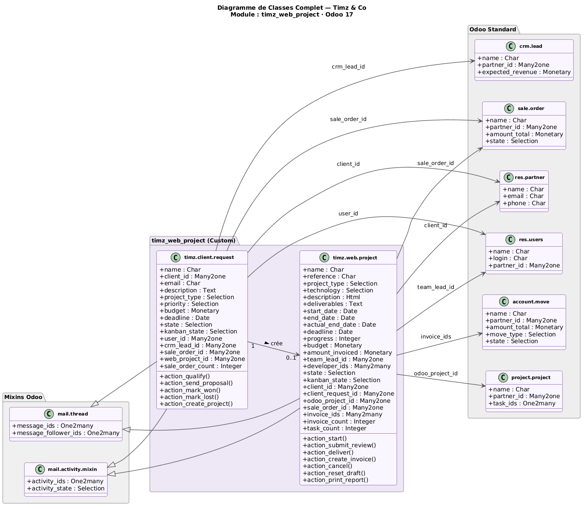

### 3.6 Modèle de données en base

Chaque classe correspond à une table PostgreSQL dans `timz_db` :

| Table PostgreSQL | Modèle Odoo | Description |
|---|---|---|
| `timz_client_request` | `timz.client.request` | Demandes clients |
| `timz_web_project` | `timz.web.project` | Projets web |
| `crm_lead` | `crm.lead` | Opportunités CRM |
| `sale_order` | `sale.order` | Commandes / devis |
| `project_project` | `project.project` | Projets Odoo natifs |
| `account_move` | `account.move` | Factures |
| `res_partner` | `res.partner` | Clients / contacts |
| `res_users` | `res.users` | Utilisateurs |

Les relations Many2one entre tables sont des **clés étrangères** (`_id` columns). Les relations Many2many passent par des **tables de jointure** (ex. `timz_web_project_res_users_rel` pour `developer_ids`).

---

## 4. Réalisation et Manuel Utilisateur

### 4.1 Accès à l'application

- URL : `http://localhost:8069`
- Base de données : `timz_db`
- Administrateur : `zenabkissir@gmail.com` / `admin`

### 4.2 Menu principal du module

Après installation du module `timz_web_project`, le menu **"Timz Web Project"** apparaît dans la barre de navigation principale avec deux sous-menus :

- **Demandes Clients** — gestion du pipeline commercial
- **Projets Web** — gestion opérationnelle des projets


---

### 4.3 Gestion des Demandes Clients

#### Vue liste des demandes

La vue liste affiche toutes les demandes avec leurs colonnes principales : nom du client, type de projet, priorité, budget, délai et état courant.

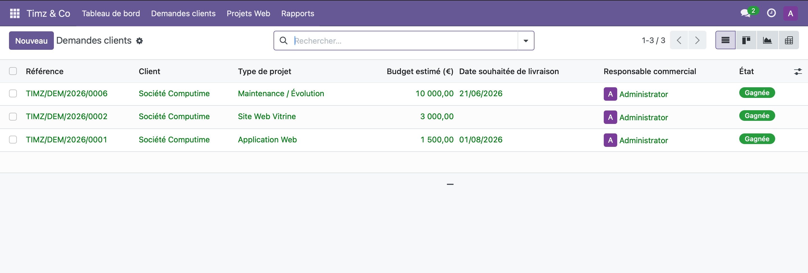


#### Vue Kanban des demandes

La vue Kanban organise les demandes par état dans des colonnes : `Nouveau`, `Qualifié`, `Proposition envoyée`, `Gagné`, `Perdu`.

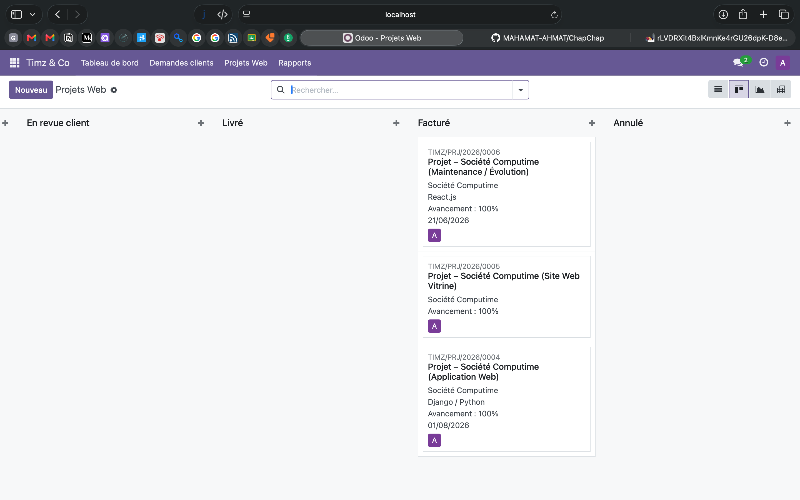


#### Formulaire d'une demande

Le formulaire de demande regroupe toutes les informations : données client, type et description du projet, budget, priorité, échéance, et les smart buttons vers le CRM, le devis et le projet associé.

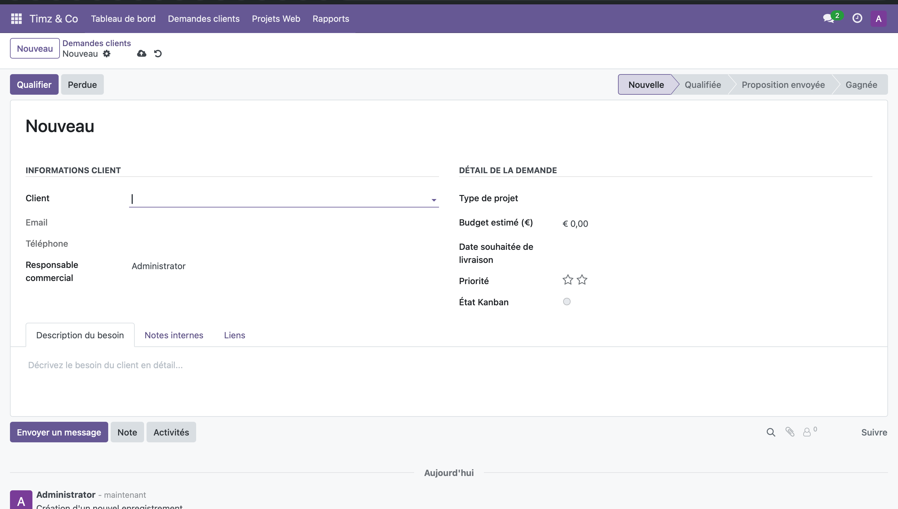


#### Workflow des boutons d'action

Les boutons de transition d'état apparaissent en haut du formulaire selon l'état courant :

| État actuel | Bouton disponible | État cible |
|---|---|---|
| `nouveau` | **Analyser et qualifier** | `qualifié` |
| `qualifié` | **Envoyer la proposition** | `proposition_envoyee` |
| `proposition_envoyee` | **Marquer Gagné** | `won` |
| `proposition_envoyee` | **Marquer Perdu** | `lost` |
| `qualifié` / `proposition_envoyee` | **Créer le projet** | — (crée `timz.web.project`) |

---

### 4.4 Gestion des Projets Web

#### Vue liste des projets

La vue liste affiche les projets avec : référence, client, type, chef de projet, dates, avancement, budget et état.

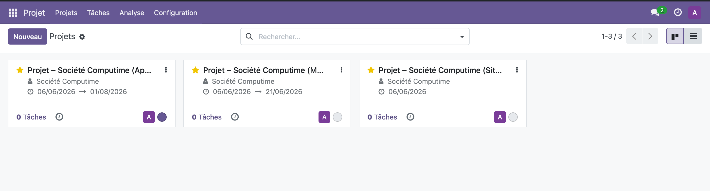


#### Formulaire d'un projet web

Le formulaire de projet regroupe les onglets : **Informations générales**, **Équipe**, **Livrables**, et les smart buttons vers les tâches Odoo, les factures et le projet natif.

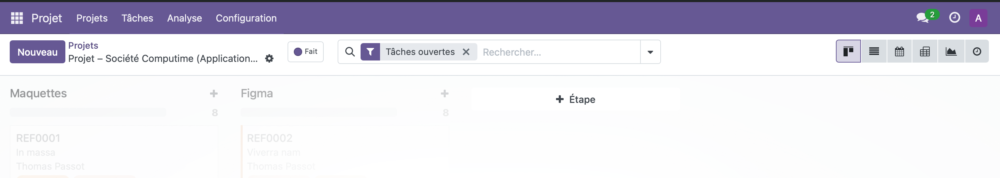

#### États du projet web

| État | Description |
|---|---|
| `brouillon` | Projet créé mais pas encore démarré |
| `en_cours` | Développement actif |
| `review` | En attente de validation interne |
| `delivered` | Livré au client |
| `invoiced` | Facturé et payé |
| `cancelled` | Annulé |


#### Smart button "Tâches"

Le bouton **Tâches** en haut du formulaire affiche le nombre de tâches liées au projet Odoo natif et permet d'y accéder directement.

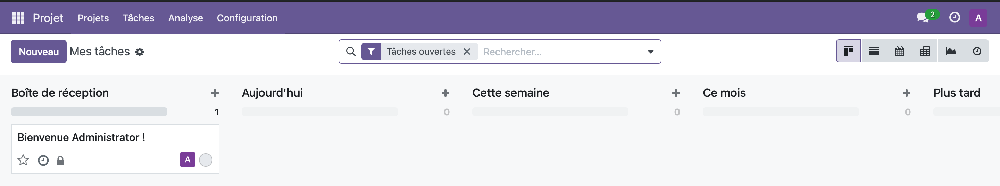

#### Création de facture depuis un projet

Le bouton **"Créer la Facture"** (visible en état `delivered`) génère automatiquement une facture (`account.move`) pré-remplie avec :
- le client du projet ;
- le montant (`budget`) comme base de facturation ;
- le journal de vente ;
- le compte de produit (revenu).

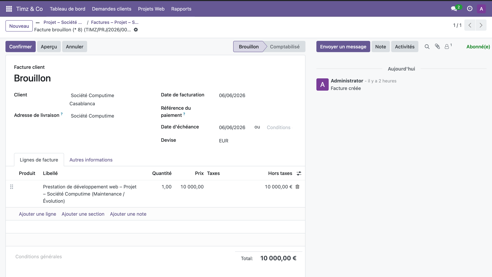

---

### 4.5 Rapport PDF

Le bouton **"Imprimer le rapport"** sur le formulaire projet génère un rapport QWeb PDF récapitulant les informations du projet (référence, client, type, équipe, dates, budget, livrables).

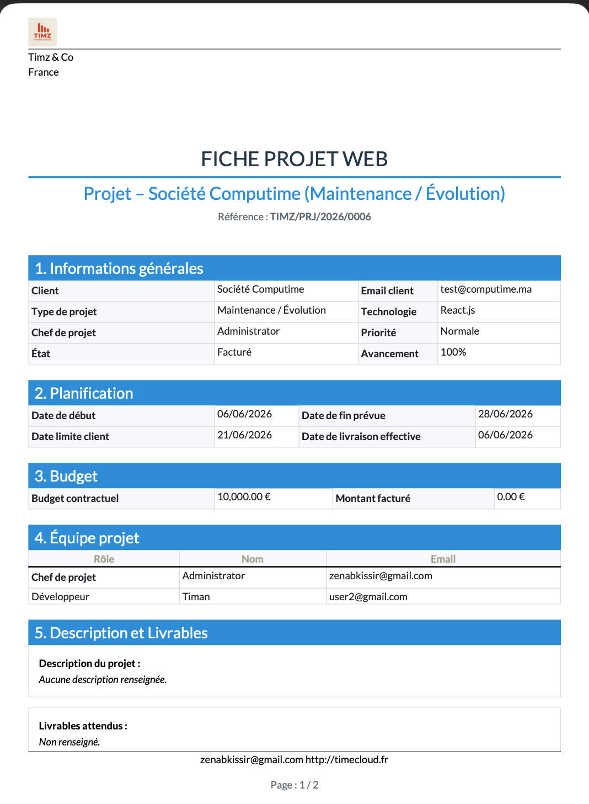

---

### 4.6 Gestion des droits d'accès

Le module définit deux groupes de sécurité dans la catégorie **"Timz Web Project"**.

#### Groupes de sécurité

| Groupe | XML ID | Hérite de |
|---|---|---|
| **Utilisateur** | `group_timz_user` | `base.group_user` |
| **Manager** | `group_timz_manager` | `group_timz_user` |

L'administrateur Odoo est automatiquement membre du groupe Manager.

#### Permissions sur les modèles (ACL)

| Modèle | Groupe | Lire | Écrire | Créer | Supprimer |
|---|---|:---:|:---:|:---:|:---:|
| `timz.client.request` | Utilisateur | ✅ | ✅ | ✅ | ❌ |
| `timz.client.request` | Manager | ✅ | ✅ | ✅ | ✅ |
| `timz.web.project` | Utilisateur | ✅ | ✅ | ❌ | ❌ |
| `timz.web.project` | Manager | ✅ | ✅ | ✅ | ✅ |

#### Règles d'accès par enregistrement (Record Rules)

| Règle | Groupe | Domaine appliqué |
|---|---|---|
| Demandes — Utilisateur | `group_timz_user` | Voit uniquement ses propres demandes (`user_id = uid`) |
| Demandes — Manager | `group_timz_manager` | Voit toutes les demandes |
| Projets — Utilisateur | `group_timz_user` | Voit les projets où il est chef ou développeur |
| Projets — Manager | `group_timz_manager` | Voit tous les projets |

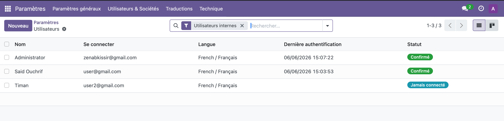


---

### 4.7 Produits de service (catalogue)

Le module crée automatiquement 5 produits de type service utilisés dans les devis générés :

| Référence XML | Nom produit | Utilisation |
|---|---|---|
| `product_timz_site_vitrine` | Site Vitrine | Devis type `website` |
| `product_timz_ecommerce` | E-Commerce | Devis type `ecommerce` |
| `product_timz_webapp` | Application Web | Devis type `webapp` |
| `product_timz_mobile` | Application Mobile | Devis type `mobile` |
| `product_timz_erp` | Intégration ERP/CRM | Devis type `erp` |

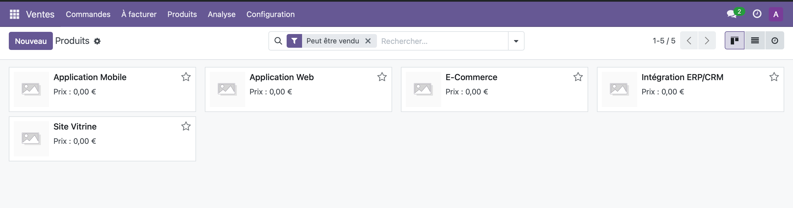

---

## 5. Conclusion

### 5.1 Bilan du projet

Ce projet a permis de concevoir et d'implémenter de bout en bout un module métier complet sur Odoo 17. Les principaux livrables réalisés sont :

| Livrable | Statut |
|---|---|
| Modélisation BPMN (3 processus) | ✅ Réalisé |
| Module Odoo custom `timz_web_project` | ✅ Fonctionnel |
| Workflow de validation multi-états | ✅ Implémenté |
| Génération automatique de devis | ✅ Avec produits de service |
| Création automatique de projets Odoo | ✅ Via smart button |
| Facturation depuis les projets | ✅ Avec journal et compte comptable |
| Rapport PDF QWeb | ✅ Imprimable |
| Gestion des droits d'accès (2 groupes) | ✅ ACL + Record Rules |
| Diagrammes de classes PlantUML | ✅ 3 variantes |

### 5.2 Difficultés rencontrées

**Technique :**

- **Renommage de champ Odoo 17** : le champ `planned_revenue` sur `crm.lead` a été renommé `expected_revenue` en Odoo 17 — erreur `KeyError` corrigée.
- **Vue dashboard vs formulaire** : Odoo choisissait le dashboard (priorité identique) plutôt que le vrai formulaire lors du clic "Nouveau" — corrigé en fixant `priority=100` sur la vue dashboard.
- **Facturation** : la création de facture nécessite un journal de type `sale` ET un compte de produit (revenu) explicites — Odoo 17 est plus strict sur les contraintes comptables qu'Odoo 16.
- **Lignes de commande sans produit** : en Odoo 17, une ligne `sale.order.line` sans `product_id` échoue en comptabilité — résolu par la création d'un catalogue de 5 produits service.

**Conceptuel :**

- La distinction entre les vues BPMN `bpmn:userTask` (tâche humaine) et `bpmn:serviceTask` (automatisation Odoo) nécessite une bonne lecture de la spec BPMN 2.0.
- La compréhension du modèle de sécurité Odoo (ACL globales + Record Rules par enregistrement) est indispensable pour une gestion fine des droits.

### 5.3 Perspectives d'évolution

1. **Portail client** : permettre aux clients de soumettre leurs demandes directement via le portail web Odoo et de suivre l'avancement de leur projet.

2. **Tableau de bord analytique** : ajouter des graphiques (chiffre d'affaires par type de projet, taux de conversion demandes → projets, délais moyens) via les vues `graph` et `pivot` d'Odoo.

3. **Notifications automatiques** : déclencher des emails/SMS aux clients à chaque changement d'état du projet (démarrage, livraison, facture envoyée).

4. **Intégration Timesheets** : relier les tâches du projet aux feuilles de temps (`hr.timesheet`) pour facturer en régie (temps passé × taux horaire).

5. **Multi-entreprise** : étendre le module pour gérer plusieurs sociétés Timz & Co avec des journaux comptables distincts.

6. **Application mobile** : permettre aux développeurs de mettre à jour l'avancement de leurs tâches depuis l'application mobile Odoo.

---

## Annexes

### Structure du module `timz_web_project`

```
timz_web_project/
├── __init__.py
├── __manifest__.py
├── data/
│   └── timz_products_data.xml      # 5 produits service
├── models/
│   ├── __init__.py
│   ├── timz_client_request.py      # Modèle Demande Client
│   └── timz_web_project.py         # Modèle Projet Web
├── security/
│   ├── ir.model.access.csv         # ACL (permissions modèles)
│   └── timz_security.xml           # Groupes + Record Rules
├── views/
│   ├── timz_client_request_views.xml
│   ├── timz_web_project_views.xml
│   ├── timz_dashboard_views.xml
│   └── timz_menus.xml
└── report/
    └── timz_project_report.xml     # Rapport QWeb PDF
```

### Commandes Docker utiles

```bash
# Démarrer l'environnement
cd odoo17-docker
docker compose up -d

# Voir les logs du serveur Odoo
docker compose logs -f odoo

# Redémarrer Odoo (après modification du module)
docker compose restart odoo

# Mettre à jour le module
docker exec -it odoo17-docker-odoo-1 \
  odoo -d timz_db -u timz_web_project --stop-after-init
```

### Fichiers sources des diagrammes

| Fichier | Outil | Description |
|---|---|---|
| [diagrammes/Bpmn/codes/processus_demande_client.bpmn](diagrammes/Bpmn/codes/processus_demande_client.bpmn) | bpmn.io | Processus 1 |
| [diagrammes/Bpmn/codes/processus_suivi_projet_web.bpmn](diagrammes/Bpmn/codes/processus_suivi_projet_web.bpmn) | bpmn.io | Processus 2 |
| [diagrammes/Bpmn/codes/processus_livraison_facturation.bpmn](diagrammes/Bpmn/codes/processus_livraison_facturation.bpmn) | bpmn.io | Processus 3 |
| [diagramme_classes_custom.puml](diagramme_classes_custom.puml) | PlantUML | Classes custom (violet) |
| [diagramme_classes_odoo.puml](diagramme_classes_odoo.puml) | PlantUML | Classes Odoo standard (gris) |
| [diagramme_classes.puml](diagramme_classes.puml) | PlantUML | Diagramme complet |

---

*Rapport du Projet de Conception de SI sur Odoo 17 — MAHAMAT AHMAT TIMAN*
